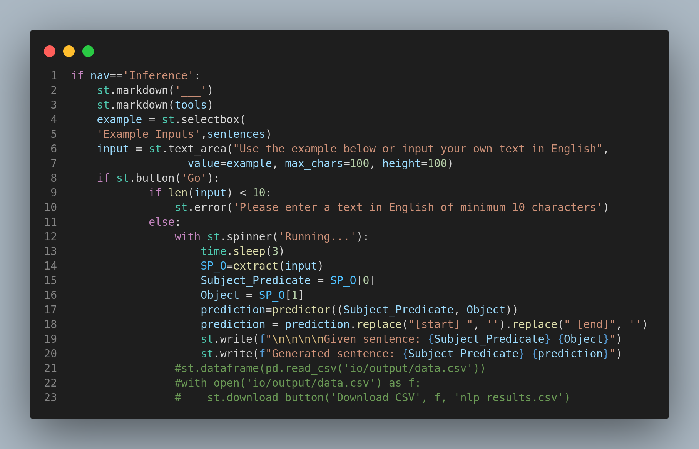
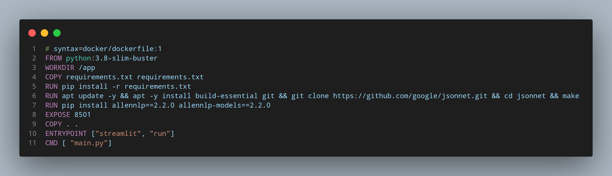

<html>
    
    <h1>KICoDi</h1>
    <h2>Knowledge Inference for nonCommunicable Diseases</h2>
    
    <h3>Please read this guide before try to run the application.</h3>
    

    This repository contains almost all the necessary stuff to run your own copy of KICoDi.
    

    

        <h3>Installing Conda</h3>
        
KICoDi works with different libraries in specific versions, so we strongly recommend create an environment dedicated to KICoDi. A good option is install <a href="https://www.anaconda.com/products/distribution" target="_blank">Conda</a> (or MiniConda) a powerful tool with some IDE's and a easy manage of <a href="https://docs.conda.io/projects/conda/en/4.6.0/_downloads/52a95608c49671267e40c689e0bc00ca/conda-cheatsheet.pdf" target="_blank">environments</a>. 
        

        
Once you have installed Conda, you must <a href="https://docs.conda.io/projects/conda/en/latest/user-guide/tasks/manage-environments.html" target="_blank">create an environment</a> from <highl>env.yml</highl> With this step you will have all necessary libraries needed to run KICoDi. Open your terminal in KICoDi directory and type:
        

        <code>conda env create -f env.yml</code>
        

        You can verify that the new environment was installed correctly typing:
        

        <code>conda env list</code>
        
To change between environments type

        <code>conda activate [name-of-your-environment]</code>
    

    

        <h3>Getting Started</h3>
        <h4>- Streamlit</h4>
        
KICoDi is an <a href="https://docs.streamlit.io/library/get-started" target="_blank">Streamlit</a> based application. The <highl>.streamlit</highl> directory contains <highl>.toml</highl> file used to customize the background color, fonts, text color and more. With Streamlit, we manage three sections of the application in <highl>main.py</highl>via sidebar settings: 'Home', 'Inference' and 'Authors'. If you want to change the information showed in these pages, you must go to <highl>media/text</highl> and modify .txt files. Streamlit supports markdown and html as markup languages. 

        <h4>- Main</h4>
        
<highl>main.py</highl> is script you need to execute in order to run the application. It calls two scripts located in <highl>src/</highl> that perform the predictions tasks.
        

        
It is the 'Inference' section that is responsible for executing the necessary functions to make predictions

        
        
When user selects an example showed from <highl>io/input/inputs.csv</highl> or types their own and press 'Go' button the 'extract' function is called.

        
The extract function receives the input text and classifies the sentence in a <highl>(Subject_Predicate, Object)</highl> tuple. For the task we use <a href="https://demo.allennlp.org/semantic-role-labeling" target="_blank">Semantic Role Labeling</a> from Allen Institute. This tool is based in <a href="https://verbs.colorado.edu/propbank/EPB-Annotation-Guidelines.pdf" target="_blank">EnglishPropBank annotations</a> and the extract function is our first attempt to automate  the creation of tuples understanding all the information provided by the Allen's <a href="https://web.stanford.edu/~jurafsky/slp3/slides/22_SRL.pdf" target="_blank">Semantic Role Labeling</a>.

        
The script for extract function is in <highl>src/srl_methods/</highl> 

        
The predictor function receives the <highl>(Subject_Predicate, Object)</highl> tuple and makes the prediction. This script is in <highl>src/transformer_predictor</highl> and uses <highl>src/transformer_modules</highl> and <highl>src/predictor_configuration.json</highl> to execute.
        

        
Nevertheless the data to train the model and export the info to make the predictions is not available in this repository. Please refer to PhD I. Arroyo in order to get the data.
        

        <h4>- AllenNLP</h4>
        
AllenNLP is a library provided from the Allen Institute for Artificial Intelligence and we needed for <highl>(Subject_Predicate, Object)</highl> tuple creation task. This version of KICoDi uses 2.2.0 version and 2.2.0 models. You need to know that AllenNLP libraries need PyTorch. The installation of AllenNLP and PyTorch libraries was done when the environment was created using <highl>env.yml</highl>.
        <ol>
            <li>You can check the installation executing:</li>
        </ol>
            <code>
                from allennlp.predictors.predictor import Predictor
            </code>
        

    

    

    <h3>Changes in KICoDi</h3>
    
If you modify, uses another libraries or improve KICoDi please share your environment using <code>conda env export > environment.yml</code>. This is important to run and get a control over KICoDi versions.

    <h4>KICoDi has a trained image in DockerHub!!</h4>
    
If you want to get access to a trained and fully functional version of KICoDi you need to install <a href="https://docs.docker.com/get-started/overview/" target="_blank">Docker</a>

    
Docker provides the ability to package and run an application in a loosely isolated and Docker Hub is a
    library and community for container images.

    
We recommend to use Docker in Linux and install with (Debian and Ubuntu)

    <code>
    sudo apt-get install docker-ce docker-ce-cli containerd.io docker-compose-plugin</code>
    
You can check the installation typing

    <code>
    sudo docker run hello-world
    </code>
    
One you installed Docker, you can download and use the KICoDi image via DockerHub

    <code>
    sudo docker pull enriquegap/kapp:v01
    </code>
    
To run the image, type

    <code>
    sudo docker run -p 8501:8501 enriquegap/kapp:v01
    </code>
    
Now, you can open your favorite browser and view the app in <highl>http://172.17.0.2:8501</highl> The 8501 is the default port to run the application.

    
To get a list of the Docker images in your PC type:

    <code>sudo docker images</code>
    
If you want to deploy your own KICoDi images or a Streamlit app with Docker, the next guide will be very useful:

    <ol>
        <li>You need the trained version to have a correct functioning of the predictor.</li>
        <li>The Dockerfile provided contains all the specifications to build your own image of KICoDi, follows</li>
        <ul>
            <li>3.8-slim-buster python version</li>
            <li>A list of requirements needed to run the app</li>
            <li>The <highl>build-essential</highl> packages required to compile AllenNLP libraries using Make, Jsonnet and more</li>
            <li>AllenNLP libraries and models</li>
            <li>The port to be used to run the application.</li>
            <li>An entry point to make our image executable.</li>
        </ul>
        
        <li>There are several ways to create the <highl>requirements.txt</highl> file, we recommend using pipreqs:</li>
        <code>python -m pipreqs.pipreqs .</code>
        
Please note we don't install AllenNLP with <code>pip install -r requirements.txt</code>, so when you create your <highl>requirements.txt</highl> be sure to delete Allen's lines.

        <li>The <highl>requirements.txt</highl> file in this repository contains all the neccesary libraries to create an image of the current version 1.0</li>
        <li>Now you can build your image typing in KICoDi directory:</li>
        <code>docker build -t [name-of-my-app]:latest .</code>
    </ol>
    
Problems with Docker and images? Please refer to E. Galicia

    

</html>
